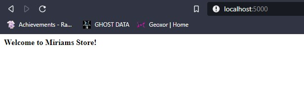
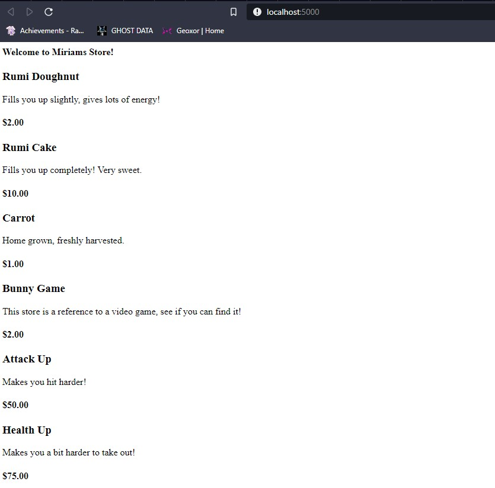
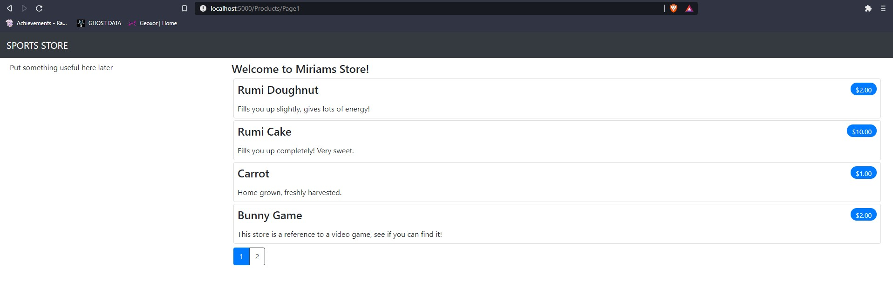

# MiriamsStore-Test-ASP.NET<br>

Student Exercise Creating a Web Application in ASP.NET.<br>
Credit for exercise belongs to: [Adam Freeman](https://www.apress.com/gp/book/9781484254394)
<br>
<br>
**Step 1:**<br>
Code used to create project:<br>
```
dotnet new globaljson --sdk-version 5.0.103 --output MiriamsStoreSln
dotnet new web --no-https --output MiriamsStoreSln --framework net5.0
dotnet new sln -o MiriamsStoreSln
dotnet sln BobsStoreSln add MiriamsStoreSln
dotnet new xunit -o MiriamsStoreSln.Tests --framework net5.0
dotnet sln MiriamsStoreSln add MiriamsStoreSln.Tests 
dotnet add MiriamsStoreSln.Tests reference MiriamsStoreSln 
```
**Step 2:**<br>
Ensuring the project runs and loads correctly on proper ports:<br>



**Step 3:**<br>
*What is Entity Framework?*
```
Enity Framework is Microsofts Object to relational mapping (ORM) framework. 
It is used to link databases and web applications together.
```
*What is a Connection String?*
```
A connection string is a string created that is used to connect to a SQL database from the code itself.
It contains the database being used, and the login for the database.
```
*What is a Database Context?*
```
Database Context is the mapping of a SPECIFIC database with a schema the program can understand.
```
*What is a Model Repository?*
```
A model repository is used to reduce repetition in your database, and can be used to retrieve a sequence of database objects.
This sequence can be queried, and any class that depends on the model repository can utilize these features.
```
*Migration vs Scaffolding?*
```
Migration is the compiler creating database tables and schema for you with the context provided.
Scaffolding is the compiler creating code for cshtml and html documents with the context provided.
```
*Seeding the database*:<br>

<br>
**Step 4:**<br>
*CSS styling and pagination*


